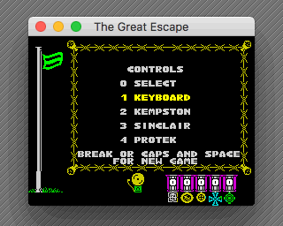

# “The Great Escape” Ported to C

[](https://github.com/dpt/The-Great-Escape-in-C/actions)

© David Thomas, 2013-2022

17th April 2022

<p align="center">
  
</p>


## Overview
This is a port to C of “[The Great Escape](http://www.worldofspectrum.org/infoseekid.cgi?id=0002125)”: the classic isometric 3D game for the 48K Sinclair ZX Spectrum in which you execute a daring escape from a wartime prison camp. Very loosely based on the film of the same name, it was created by [Denton Designs](http://en.wikipedia.org/wiki/Denton_Designs) and published in 1986 by [Ocean Software](http://en.wikipedia.org/wiki/Ocean_Software).

[Over here](https://github.com/dpt/The-Great-Escape/) I reverse engineered the original game from a binary snapshot of the Spectrum version, decoding the graphics, data tables and all of the logic. Originally written in [Z80](http://en.wikipedia.org/wiki/Zilog_Z80) assembly language, I have translated it into portable C code where now builds and runs **exactly** like the original on macOS, Windows and RISC OS but without the need of an [emulator](http://fuse-emulator.sourceforge.net/).

The portable C sources have allowed builds for the [web](http://www.davespace.co.uk/TheGreatEscape/TheGreatEscape.html), using emscripten and even the [BBC Micro](https://stardot.org.uk/forums/viewtopic.php?f=74&t=23478), via a Raspberry Pi second processor.


## Project Write-up

http://www.davespace.co.uk/the.great.escape/ (2019)


## Goals of the Project
1. Fully disassemble, document and understand the original game.
	* Attempting to reimplement the game logic forces you to explore every nook and cranny of the game logic, enabling a complete reimplementation to be made and the original code fully understood.
1. Reimplement The Great Escape in portable C code.
	* While being as accurate a recreation of the original as possible.
1. Fix some bugs in the original game.
1. Analyse the before-and-after metrics.
	* How much bigger and slower is the compiled C reimplementation compared to the original game?
	* What can we learn from the original’s tight coding techniques?
1. Provide a basis for porting the game to contemporary systems of the ZX Spectrum.
	* Although old ports of the game exist for the [PC](http://www.abandonia.com/en/games/534/Great+Escape,+The.html), [C64](http://www.lemon64.com/?game_id=1090) and [CPC](http://www.amstradabandonware.com/en/gameitems/the-great-escape/1179), retro fans would like to see the game on [other contemporary systems](http://atariage.com/forums/topic/239167-new-game-great-escape/) too.


## Running the Game
The port is an exact recreation of the ZX Spectrum version of The Great Escape including the input device selection menu. It builds and runs on macOS, Windows and RISC OS. The macOS version is currently the "best" featuring the menu music and sound effects which the Windows port lacks.

When you start the game hit `0` to start - this will let you define your preferred keys. You could also choose `3` for Sinclair (keys 6/7/8/9/0). The macOS port will let you choose Kempston and use the arrow keys and `.` for fire.

There are various other controls which vary by OS. On macOS consult the menus for keyboard shortcuts.

The front-ends attempt to always preserve the game's aspect ratio and snap to whole pixels.


## Current Builds
| Port | Maintained? | Notes |
|-|-|-|
| macOS CMake | Yes | My default build; the most likely to be up-to-date. To build use `cd <src> && mkdir build && cd build && cmake .. && cmake --build .` or `[build.sh](build.sh)` |
| macOS native | Probably | To build open up the Xcode project `platform/osx/The Great Escape.xcodeproj` and build that using ⌘B. Run using ⌘R. |
| Windows CMake | Yes | CMake build - like above |
| Windows native | Probably | Needs Visual Studio 2013. Trunk build lacks sound and UI niceties (but there are improvements on a branch somewhere...) To build open up the Visual Studio solution `platform/windows/TheGreatEscape/TheGreatEscape.sln` and build that using F7. Run using F5. |
| RISC OS | Yes | Runs on RISC OS 3.1 or later. Sound requires a Risc PC or later with a 16-bit sound system. To build this uses GCCSDK and CMake. If you're nutty enough to want to build the RISC OS version then you might want to talk to me first. |
| Makefile | Occasionally | Minimal headless driver for testing. Runs the game for 100,000 iterations of the main loop then stops. |
| SDL | Perhaps | SDL build. No sound or UI niceties and broken timing. |
| Browser, via emscripten | Maybe | [Try it here](http://www.davespace.co.uk/TheGreatEscape/TheGreatEscape.html) using the arrow keys and `.` for fire. This uses the SDL build but targets emscripten. The structure of the game is not exactly amenable to the browser world (the RISC OS build has a similar issues). |

Consult the [github actions file](.github/workflows/ci.yml) for exact build commands.


## Components

### `TheGreatEscape`
This is the main game reimplemented in a single (static) library.

### `ZXSpectrum`
Defines an interface to a virtual ZX Spectrum to which the game talks, replacing the bare-metal `IN` and `OUT` instructions and providing a screen to draw to, its border, a keyboard and a speaker. This can convert the Spectrum screen memory to 4bpp or 32bpp pixel formats pretty quickly.


## Source Layout
``` text
./
    include/            - public headers
        TheGreatEscape/
        ZXSpectrum/
    libraries/          - sources
        TheGreatEscape/
            include/    - private headers
        ZXSpectrum/
    platform/           - platform-specific source
        generic/        - generic Makefile build environment
        osx/            - Xcode build environment
        riscos/         - RISC OS build environment
        windows/        - Windows build environment
```


## Chat
[](https://gitter.im/The-Great-Escape/Lobby?utm_source=badge&utm_medium=badge&utm_campaign=pr-badge&utm_content=badge)


# Related Links
[Porting Chuckie Egg](http://marklomas.net/ch-egg/articles/porting-ch-egg.htm)
